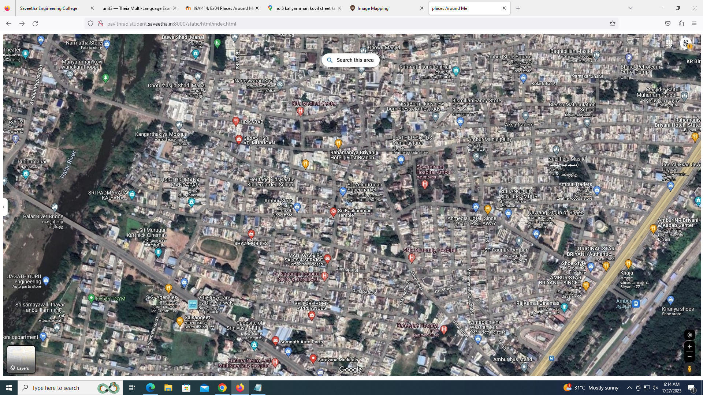
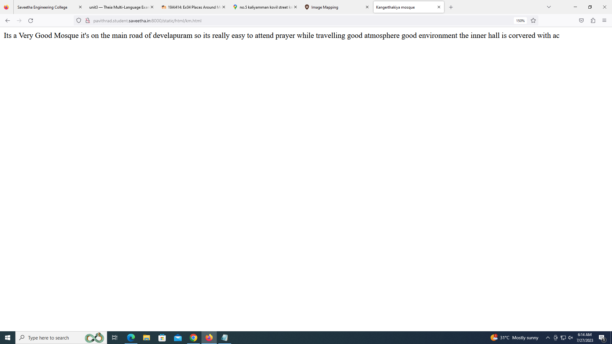
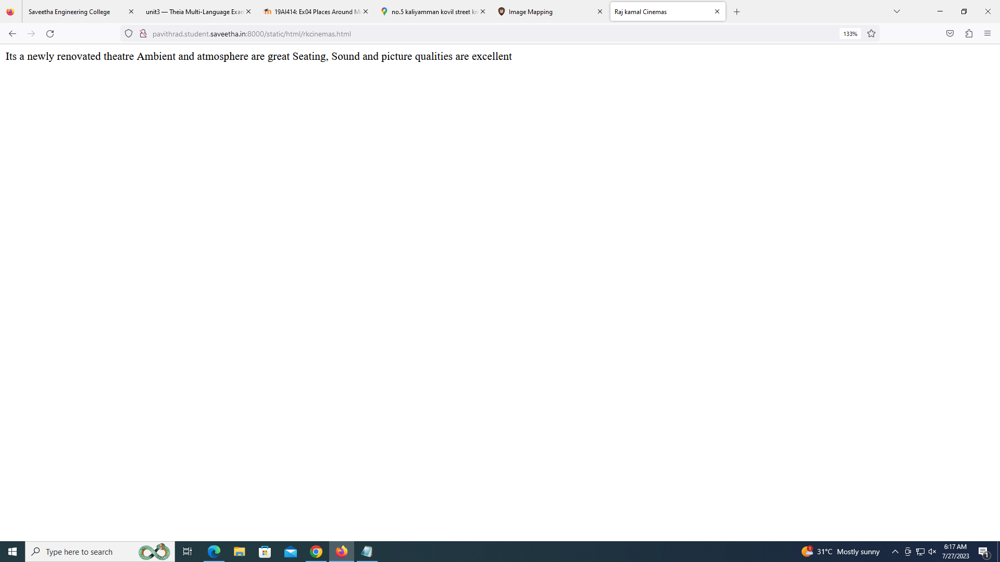

# Places Around Me
## AIM:
To develop a website to display details about the places around my house.

## Design Steps:

### Step 1:
Create a folder and clone the repository into that folder.
### Step 2:
Start a project named myproj and create an app inside it.
### Step 3:
Do the required changes in settings.py
### Step 4:
Open google maps and take a screenshot of a place near your house, then open image map and create a html page for some places around your place then get the code and complete index.html in static files 
### Step 5:
Then create a html file for each of the places that you have selected
### Step 6:
Run the server and check if the web pages are loding perfectly
### Step 7:
Then reposit the same to github using the git commands. 

## Code:

### index.html:
```
<!DOCTYPE html>
<html>
    <head>
        <title>
            places Around Me
        </title>
    </head>
    <body>
        
<map name="image-maps-2023-07-27-025516" id="ImageMapsCom-image-maps-2023-07-27-025516">
<area  alt="" title="Rahamaniya biriyani" href="/static/html/rahamaniyabiriyani.html" shape="rect" coords="910,309,960,359" style="outline:none;" target="_self"     />
<area  alt="" title="Nageswaren Kovil" href="/static/html/nageswarankovil.html" shape="rect" coords="741,131,791,181" style="outline:none;" target="_self"     />
<area  alt="" title="Kangerthakiya Mosque" href="/static/html/km.html" shape="rect" coords="440,255,505,346" style="outline:none;" target="_self"     />
<area  alt="" title="Raj Kamal Cinemas" href="/static/html/rkcinemas.html" shape="rect" coords="1489,712,1554,803" style="outline:none;" target="_self"     />
<area  alt="" title="Original Star Biriyani" href="/static/html/startbiriyani.html" shape="rect" coords="1603,591,1673,657" style="outline:none;" target="_self"     />
<area shape="rect" coords="1905,933,1907,935" alt="Image Map" style="outline:none;" title="Image Map" href="https://www.image-maps.com/" />
</map>

    </body>
</html>
```

### km.html
```
<!DOCTYPE html>
<html>
    <head>
        <title>
            Kangerthakiya mosque
        </title>
    </head>
    <body>
        Its a Very Good Mosque it's on the main road of develapuram so its really easy to attend prayer while travelling good atmosphere good environment the inner hall is corvered with ac
    </body>
</html>
```
### nageswarankovil.html
```
<!DOCTYPE html>
<html>
    <head>
        <title>
            NAGESWARAN KOVIL
        </title>
    </head>
    <body>
        Nageswaran Temple is a Hindu Temple Dedicated to Lord Shiva located in the Heart of Ambur Town in Thirupaatur District of TSMIL
    </body>
</html>
```
### rahamaniyabiriyani.html
```
<!DOCTYPE html>
<html>
    <head>
        <title>
            RAHAMANIYA BRIYANI
        </title>
    </head>
    <BODY>
        Rahamaniya briyani,at ambur,tamilnadu, conjures a cheerful ambience and enticing flavours we seek all your guests with the prefect dining
    </BODY>

</html>
```
### rkcinemas.html
```
<!DOCTYPE html>
<html>
    <head>
        <title>
            Raj kamal Cinemas
        </title>
    </head>
    <body>
        Its a newly renovated theatre Ambient and atmosphere are great Seating, Sound and picture qualities are excellent 
    </body>
</html>
```
### starbiriyani.html
```
<!DOCTYPE html>
<html>
    <head>
        <title>
            STAR BIRIYANI
        </title>
    </head>
    <body>
        The flavour and taste of meat is more dominant in ambur briyani than the other ones due to the fewer species used
    </body>
</html>
```

## Output:





## Result:
Thus the website is developed to display details about the places around my house.